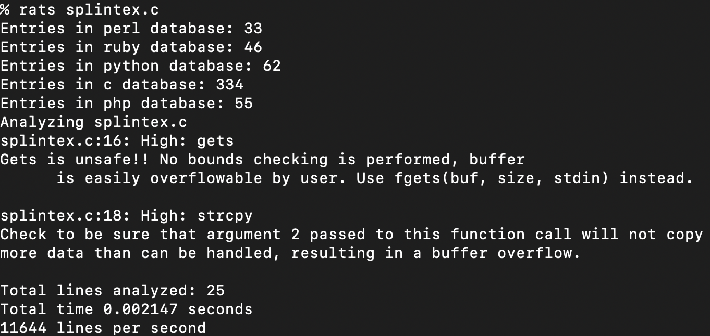
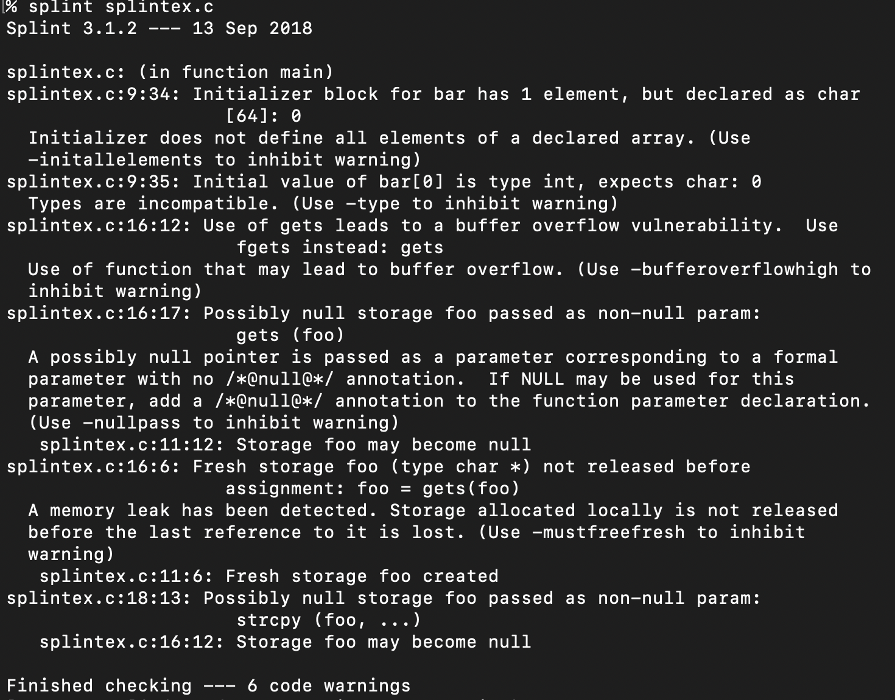
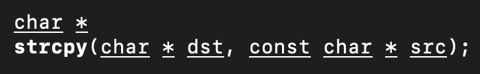
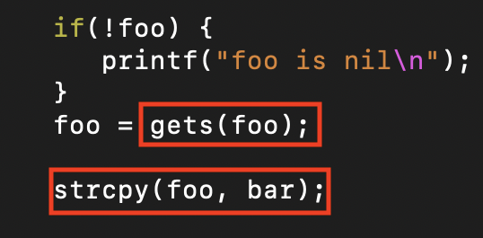
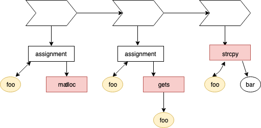
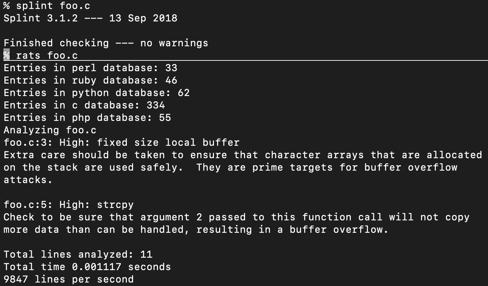
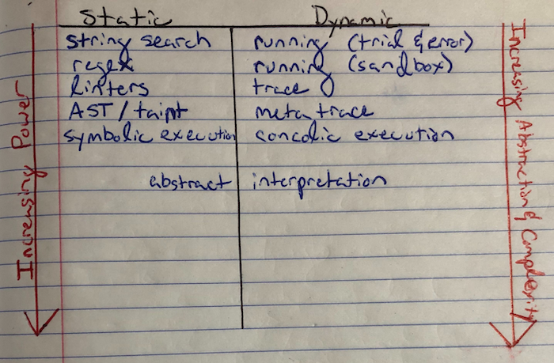

# symbolically executing a fuzzy tyrant
## or, how to fuck literally anything
### a tragedy in four symbolic acts of Verdi's Nabucco

---

# dramatis personae

```
[lojikil.com]
Stefan Edwards (lojikil) is not presently logged in.

- Assurance Practice Lead at Trail of Bits
- Twitter/Github/Lobste.rs: lojikil
- Works in: Defense, FinTech, Blockchain, IoT, compilers,
vCISO services
- Previous: net, web, adversary sim, &c. 
- Infosec philosopher, programming 
language theorist, everyday agronomer, father (doge, 
human), future-husband.

WARNING: DEAF
WARNING: Noo Yawk
```

---

# overture

#### our tragedies:
1. prologos (Jerusalem)
1. the traditional kingdoms (The Impious Ones)
   1. what are they & how do they work
   1. coverage?
1. a fuzzy tyrant (The Prophecy)
   1. of fuzzing and traditional testing
   1. understanding property coverage 
1. his symbolic execution (The Broken Idol)
   1. program analysis
   1. concolic and symbolic  

<!--
footer: @trailofbits::@lojikil::symbolically executing a fuzzy tyrant
page_number: true
-->

---

# prologos: Jerusalem
this talk covers three main items:

1. how can we "do better" than traditional tooling?
2. what does this look like?
3. can we make "formal" tools more accessible?

---

# prologos: Jerusalem (_or, what the actual fuck, loji?_)
## three main take aways:

1. traditional tools have a traditional place
2. formal verification techniques **are accessible for _everyone_** 
3. a rough intro to program analysis

---

# act 1: traditional testing

### _scene 1:_ Traditional infosec testing techniques and their forebearance upon our understanding of systems

### _sennet:_ Enter: _certain_ traditional tools

---

# a1s1: our traditional dichotomy

<!-- traditionally we split into two camps:
 - static assessments with or without tooling
 - dynamic assessments

I'm purposefully including things like red team and the 
like in here
-->


---

# a1s1: what are they

- static: linters, code formatters, unsafe function checkers,...
- dynamic: runners, sandboxes, various execution environments...
- basically: the most simple sorts of tests possible
- low barrier to entry, low quality of bugs caught

---

# a1s1: example code

```
int
main(void) {
     char *foo = nil, bar[64] = {0};
     
     foo = malloc(sizeof(char) * 128);
     
     if(!foo) {
     	printf("foo is nil\n");
     }
     
     foo = gets(foo);
     
     strcpy(foo, bar);
     
     printf("%s\n", bar);
     
     free(foo);
     return 0;
}
```

---

# a1s1: `rats`



---

# a1s1: `rats`

- we get two hits: `gets` and `strcpy`
- `fgets` rec is good
- `strcpy` rec ... not as much 
- about as simple as we can get
    - code in
    - list of findings out 

---

# a1s1: `splint` 



---

# a1s1: `splint`

- better: we get six hits (FP) initializer x 2, `gets`, NPE, potential memory leak 
- but `strcpy` tho?
- still, p simple:
    - code in
    - list of findings
---

# a1s1: issues

- lots of FPs
- easily fooled (ever seen `nopmd` in Java code?)
- completely misses intent:
    - `strcpy(foo, bar)` is wrong
  
- same for naïve dynamic testing: easily fooled

---

# a1s2: how they work

- this all goes back to how these tools work
- very simple models for code



---

# a1s2: how they work
- Splint builds a more informationally-dense model of code

<!-- 
- we have some dangerous functions
- some null-able variables (foo)
- some progression in code...
-->



---

# a1s2: how they work => coverage

- the model of a thing impacts what we can test

```
int
main(void) {
    char buf[7] = "\0\0\0\0\0\0", foo[7] = "GrrCon";

    strcpy(buf, foo);

    printf("%s\n", buf);

    return 0;
}
```

---

# a1s3: coverage

<!--
so our ability for form higher level
models of our code impacts our
ability to understand things. Here 
we can see that 
-->



---

# a1s3: coverage (or, why do I care?)

- as {program, malware, ...} analysts, we need to model our code
- adversaries will have decent understanding of their intent
- ... which we must discover



---

# act 2: a fuzzy tyrant

### _scene 1:_ On the differences between what is oft referred to as fuzzing and what we mean by fuzzing

### _sennet:_ Enter: _modern_ fuzzy tyrants

---

# act 3: his symbolic execution

### _scene 1:_ The search space of a program is important, so let us find the ways to explore all this space

### _sennet:_ Enter: a constrained guillotine

---