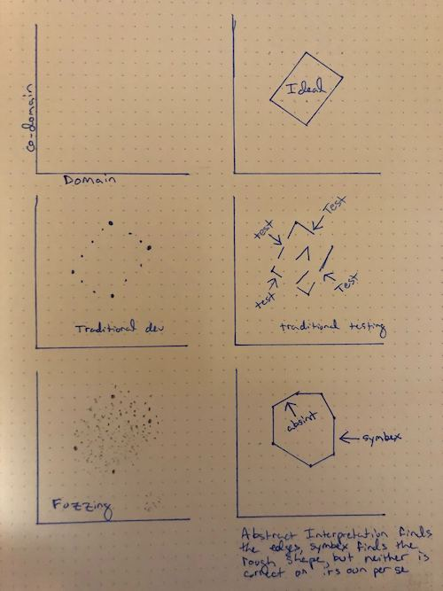
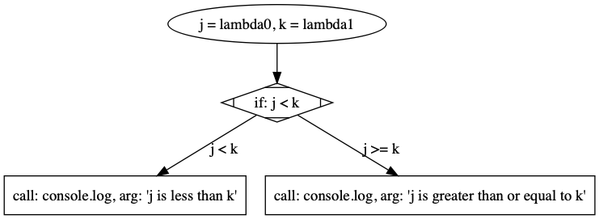

# symbolically executing a fuzzy tyrant
## or, how to fuck literally anything
### a tragedy in four symbolic acts of Verdi's Nabucco

---

# dramatis personae

```
[lojikil.com]
Stefan Edwards (lojikil) is not presently logged in.

- Assurance Practice Lead at Trail of Bits
- Twitter/Github/Lobste.rs: lojikil
- Works in: Defense, FinTech, Blockchain, IoT, compilers,
vCISO services, threat modeling
- Previous: net, web, adversary sim, &c. 
- Infosec philosopher, programming 
language theorist, everyday agronomer, father.

WARNING: DEAF
WARNING: Noo Yawk
```

---

# overture

#### our tragedies:
1. prologos (Jerusalem)
1. the traditional kingdoms (The Impious Ones)
   1. what are they & how do they work
   1. coverage?
1. a fuzzy tyrant (The Prophecy)
   1. of fuzzing and traditional testing
   1. understanding property coverage 
1. his symbolic execution (The Broken Idol)
   1. program analysis
   1. concolic and symbolic  

<!--
footer: @trailofbits::@lojikil::symbolically executing a fuzzy tyrant
page_number: true
-->

---

# prologos: Jerusalem
this talk covers three main items:

1. how can we "do better" than traditional tooling?
2. what does this look like?
3. can we make "formal" tools more accessible?

---

# prologos: Jerusalem (_or, what the actual fuck, loji?_)
## three main take aways:

1. traditional tools have a traditional place
2. formal verification techniques **are accessible for _everyone_** 
3. a rough intro to program analysis

<!--

and really, if you take anything away from this talk, it's how to do program & language analysis better.

-->

---

# prologos: Jerusalem


_[source: Weird Machines](https://en.wikipedia.org/wiki/Weird_machine)_

---

# prologos: Jerusalem



---

# prologos: Jerusalem

- more than anything: this talk is about understanding code
    - Malware
    - White/Clear box testing
    - Stolen/RE'd code  

---

# act 1: traditional testing

### _scene 1:_ Traditional infosec testing techniques and their forebearance upon our understanding of systems

### _sennet:_ Enter: _certain_ traditional tools

---

# a1s1: our traditional dichotomy

<!-- traditionally we split into two camps:
 - static assessments with or without tooling
 - dynamic assessments

I'm purposefully including things like red team and the 
like in here
-->


---

# a1s1: what are they

- static: linters, code formatters, unsafe function checkers,...
- dynamic: runners, sandboxes, various execution environments...
- basically: the most simple sorts of tests possible
- low barrier to entry, low quality of bugs caught

---

# a1s1: example code

```c
int
main(void) {
     char *foo = nil, bar[64] = {0};
     
     foo = malloc(sizeof(char) * 128);
     
     if(!foo) {
     	printf("foo is nil\n");
     }
     
     foo = gets(foo);
     
     strcpy(foo, bar);
     
     printf("%s\n", bar);
     
     free(foo);
     return 0;
}
```

---

# a1s1: `rats`


---

# a1s1: `rats`

- we get two hits: `gets` and `strcpy`
- `fgets` rec is good
- `strcpy` rec ... not as much 
- about as simple as we can get
    - code in
    - list of findings out 

---

# a1s1: `splint` 


---

# a1s1: `splint`

- better: we get six hits (FP) initializer x 2, `gets`, NPE, potential memory leak 
- but `strcpy` tho?
- still, p simple:
    - code in
    - list of findings
---

# a1s1: issues

- lots of FPs
- easily fooled (ever seen `nopmd` in Java code?)
- completely misses intent:
    - `strcpy(foo, bar)` is wrong
  
- same for naive dynamic testing: easily fooled

---

# a1s2: how they work

- this all goes back to how these tools work
- very simple models for code


---

# a1s2: how they work
- Splint builds a more informationally-dense model of code

<!-- 
- we have some dangerous functions
- some null-able variables (foo)
- some progression in code...
-->


---

# a1s2: how they work => coverage

- the model of a thing impacts what we can test

```c
int
main(void) {
    char buf[7] = "\0\0\0\0\0\0", foo[7] = "GrrCon";

    strcpy(buf, foo);

    printf("%s\n", buf);

    return 0;
}
```

---

# a1s3: coverage

<!--
so our ability for form higher level
models of our code impacts our
ability to understand things. Here 
we can see that 
-->


---

# a1s3: coverage (or, why do I care?)

- as {program, malware, ...} analysts, we need to model our code
- adversaries will have decent understanding of their intent
- ... which we must discover


---

# act 2: a fuzzy tyrant

### _scene 1:_ On the differences between what is oft referred to as fuzzing and what we mean by fuzzing

### _sennet:_ Enter: _modern_ fuzzy tyrants

---

# a2s1: on fuzzing

- traditionally: throwing random data at an app
- what we mean: random mutation testing, property testing
    - can be mutated at the string level
    - can be highly structured 

---

# a2s1: on fuzzing

- def in the toolbox: fuzzdb, SecLists, IntruderPayloads...
- missing: mutation of program state
- remember our weird machines


<!--
Fuzzing certainly is in the purview of traditional testing, but mostly in the "random input" side of things. What we want here are things that generate *structured* input, either gramatically or mutationally. We're looking for random input states that bring us to "weird machines," or unintended states within our programs.
-->

---

# a2s1: on fuzzing

<!--

talk about what fuzzing does, and explain how it relates to coverage..
	
-->

- what we expect: `string`
- naive: random bytes
- mutation: accept valid data, and output N variants
- grammar: accept a definition of data, generate random data
- property testing: define functions, mutate data
- perhaps with instrumentation into program state

---

# a2s1: on fuzzing

<!--

as humans it's really hard for us to think about all the various ways in which data may break; fuzzing helps increase coverage there

-->

- the goal: greater depth of coverage
- beyond what humans can see
- ${FUZZ JS program here}

---

# a2s2: a fuzzy notion of coverage

- we generate data and watch program result
- want: program to walk other paths
- get: _deeply shrugging man emoji_

<!--

we have to watch our program to see if it did anything useful; depending on the seed, the mutation algorithm or the like, and the state of the program, we may have a whole lotta nothing in the results

-->

---

# a2s2: a fuzzy notion of coverage

<!--

each of these is useful for a different thing. with systems like AFL, we literally reach into the binary and watch what it's doing, attempting to generate data that forces the program along different paths. With property testing, we're attempting to specify more of the conditions of program execution that we expect. And with newer techniques like grey-box fuzzing, we're doing a bit of both: allowing a system to be instrumented *and* attempting to discover invariants

all of these techniques have a simple goal: to increase the "surface area" of a "weird machines" within the program you're testing. 
-->

- different ways to increase coverage:
  - reach into the binary/system (afl)
  - deeply specify program invariants (property testing)
  - newer techniques, such as grey-box fuzzing
- discover new  territory within a program 

---

# a2s2: a fuzzy notion of coverage

<!--

all of the work of fuzzing belies a fundamental point: we're attempting to discover all the various paths 

-->


- fundamental point: we need to uncover paths
- programs themselves are just graphs
  - constrained by conditions
  - constrained by input
- Can we discover & graph all paths?  
---

# act 3: his symbolic execution

### _scene 1:_ my dear, the depths of your program space run far and wide, let me explore the paths and constraints of your heart as a symbol of our love

### _sennet:_ Enter: a constrained guillotine

---

# a3s1: program space 

- at their hearts, programs are just graphs:
  - nodes represent actions
  - edges represent constraints

```js
if(j < k) {
    console.log("j is less than k");
} else {
    console.log("j is greater  than or equal to k");
}
```

---

#  a3s1: program space

<!--

there is no difference between the above JavaScript code and the following graph:

-->



<!--

this tells us two things:

- we know the conditions under which we print both sides of the `if`
- we know roughly what needs to be generated for a given branch 
-->

---

# a3s1: program space

- symbolic execution (and related techniques) provide us these graphs
- generate graphs & constraints, then solve them
  - by various means
- **extremely** useful for security
  - KLEE, Manticore, Mythril, &c

---

# a3s1: program space

- the problem: work on binary code
- as malware analysts, we may not always have binary
  - VBA/VBScript, JScript, JavaScript, PowerShell
  - esp. useful for uncovering hosts, second stage, &c
  - most solutions are fancy sandboxes
  - require complete code for execution

---

# a3s1: program space

- decided to fix that: github.com/lojikil/uspno.9
  - "Unnamed Symbex Project No. 9" 
- focus on HLLs
- works on partial code 
- safe by default
- **very** new: began life 26 SEP 2019
- Basically: an ugly Scheme-dialect

---

# a3s1: program analysis 
