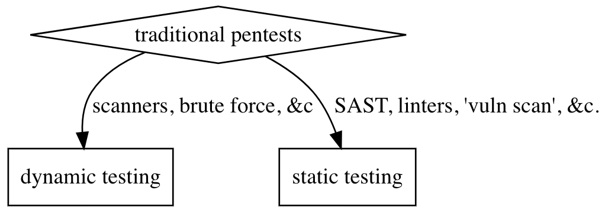

# symbolically executing a fuzzy tyrant
## or, how to fuck literally anything
### a tragedy in four symbolic acts of Verdi's Nabucco


---

# overture

#### our tragedies:
1. prologos (Jerusalem)
1. the traditional kingdoms (The Impious Ones)
   1. what are they & how do they work
   1. coverage?
1. a fuzzy tyrant (The Prophecy)
   1. of fuzzing and traditional testing
   1. understanding property coverage 
1. his symbolic execution (The Broken Idol)
   1. program analysis
   1. concolic and symbolic  

<!--
footer: Stefan Edwards::@lojikil
page_number: true
-->

---

# dramatis personae

```
[lojikil.com]
Stefan Edwards (lojikil) is not presently logged in.

- Principal Security Consultant at Trail of Bits
- Twitter/Github/Lobste.rs: lojikil
- Works in: Defense, FinTech, Blockchain, IoT, compilers,
vCISO services
- Previous: net, web, adversary sim, &c. 
- Infosec philosopher, amateur^wprofessional programming 
language theorist, everyday agronomer, father (doge, 
human), future-husband.

WARNING: DEAF
WARNING: Noo Yawk
```

---

# prologos: Jerusalem
this talk covers three main items:

1. how can we "do better" than traditional tooling?
2. can we make "formal" tools more accessible?
3. 

---

# prologos: Jerusalem (_or, what the actual fuck, loji?_)
## three main take aways:

1. traditional tools have a traditional place
2. formal verification techniques are accessible for everyone 
3. how to do program analysis of JavaScript malware

---

# act 1: traditional testing

### _scene 1:_ Traditional infosec testing techniques and their forebearance upon our understanding of systems

### _sennet:_ Enter: _certain_ traditional tools

---

# a1s1: our traditional dichotomy

<!-- traditionally we split into two camps:
 - static assessments with or without tooling
 - dynamic assessments

I'm purposefully including things like red team and the 
like in here
-->



---

# a1s1: what are they

- 